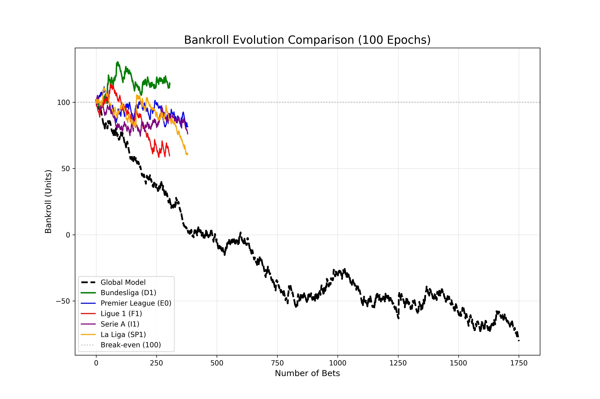
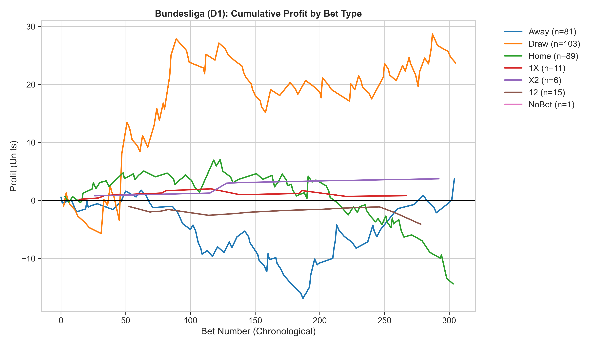
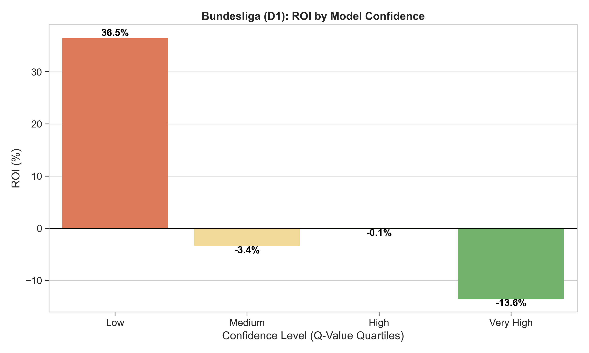
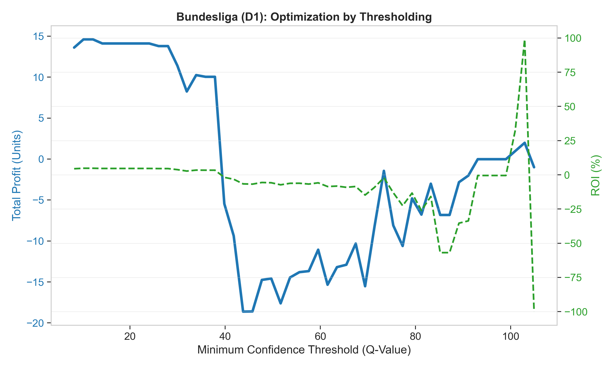
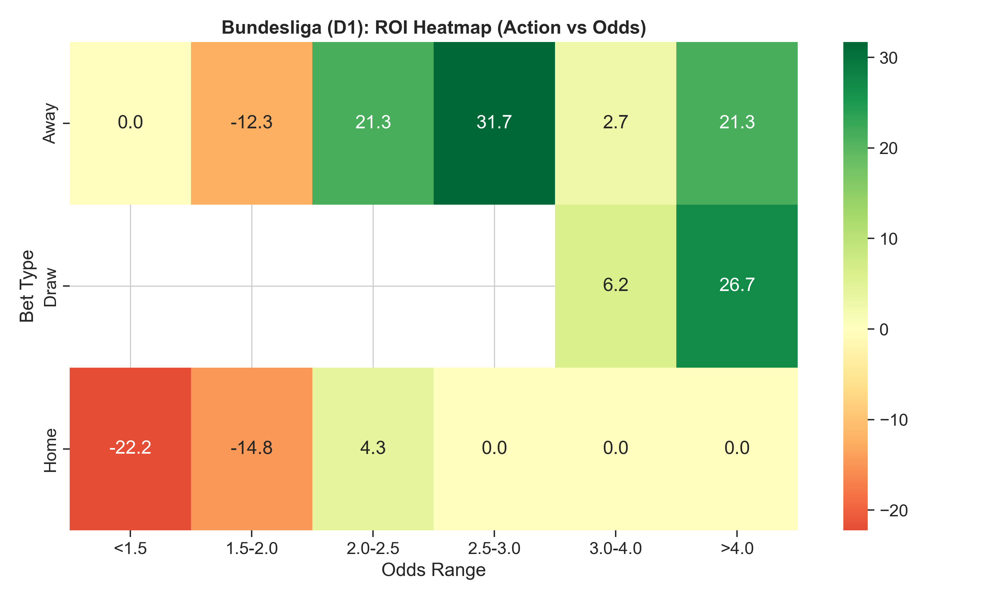
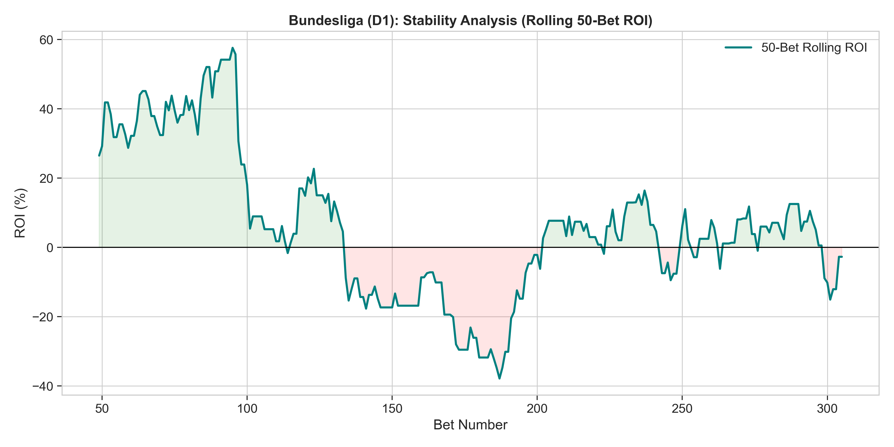

# HRM-DQN: Hierarchical Reasoning Model-Enhanced Deep Q-Learning for Soccer Prediction Outcomes

> **Paper accepted at:** The 23rd International Conference on Mobile Systems and Pervasive Computing (MobiSPC), August 18–20, 2026, Athens, Greece

## 📄 Abstract

Predicting soccer match outcomes for financial gain remains challenging due to the sport's stochasticity and market efficiency. This paper introduces **HRM-DQN**, a reinforcement learning framework integrating a Hierarchical Reasoning Model (HRM) with a Dueling Double Deep Q-Network. The architecture uses a Graph Convolutional Network (GCN) to reason about abstract match dynamics before passing hierarchical state representations to a betting agent.

We evaluate HRM-DQN on three seasons (2022–2025) of data from five major European leagues. Comparing a generalized Global Model against specialized League-Specific agents, we find that while the global approach yields **−10.67% ROI**, the Bundesliga-specific agent achieves **+4.46% ROI** with under 20% maximum drawdown.

---

## 🏗️ Architecture

The HRM-DQN architecture processes raw match data through three hierarchical layers before feeding abstract state representations to a Dueling DQN agent:


1. **Perception Layer** — LSTM + MLP + Embeddings encode temporal match statistics, odds, and metadata
2. **Reasoning Layer** — GCN-based relational reasoning over abstract match concepts (attack potency, defensive solidity, market expectations)
3. **Abstraction Layer** — Attention-weighted concept aggregation into a compact state vector
4. **Dueling Double DQN** — Value/Advantage stream separation with Double DQN bias correction

---

## 📊 Key Results

### Performance Comparison

| Model | ROI (%) | Hit Rate (%) | Net Profit (Units) |
|---|---|---|---|
| **Global Model** | −10.67 | 37.02 | −180.37 |
| **Bundesliga (D1)** | **+4.46** | **40.98** | **+13.61** |
| Premier League (E0) | −5.02 | 37.87 | −18.44 |
| Serie A (I1) | −6.47 | 37.13 | −23.88 |
| La Liga (SP1) | −10.32 | 35.98 | −39.00 |
| Ligue 1 (F1) | −13.24 | 30.82 | −40.39 |

### Bankroll Evolution & Profit Breakdown

The Bundesliga agent maintains a steady upward bankroll trajectory, driven primarily by Draw and Home win predictions.

<p align="center">
  
  
</p>

### Signal Quality & Threshold Optimization

The model's Q-value confidence correlates with ROI, enabling confidence-based threshold filtering to boost returns from +4.46% to over +15%.

<p align="center">
  
  
</p>

### Market Efficiency & Strategy Stability

The agent identifies profitable "sweet spots" in mid-range odds (2.0–3.0) for Away bets, while maintaining consistent positive rolling ROI.

<p align="center">
  
  
</p>

---

## 📁 Repository Structure

```
HRM-DQN/
├── manuscript.tex              # LaTeX manuscript (Elsevier Procedia template)
├── requirements.txt            # Python dependencies
├── src/                        # Source code
│   ├── models.py               # HRM-DQN architecture (GCN + Dueling DQN)
│   ├── train.py                # Training loop with experience replay
│   ├── evaluate.py             # Backtesting and evaluation
│   ├── environment.py          # Betting environment (MDP)
│   ├── data_loader.py          # Dataset preprocessing & feature engineering
│   ├── replay_buffer.py        # Prioritized experience replay
│   └── generate_*.py           # Plot generation scripts
├── checkpoints/                # Trained model weights (.pth)
├── results/                    # Predictions (CSV) & figures (PNG/PDF)
│   └── pdf/                    # High-resolution figures for manuscript
├── scripts/                    # Experiment runners & debug utilities
└── docs/                       # Draft notes & discussion documents
```

---

## ⚙️ Setup & Reproduction

### Requirements

- Python 3.10+
- Apple Silicon (MPS) or CUDA GPU recommended

### Installation

```bash
pip install -r requirements.txt
```

### Training

```bash
# Train Global Model (all 5 leagues)
python -m src.train --mode global --epochs 100

# Train League-Specific Model (e.g., Bundesliga)
python -m src.train --mode league --league D1 --epochs 100
```

### Evaluation

```bash
python -m src.evaluate --checkpoint checkpoints/hrm_dqn_league_D1.pth
```

### Generate Figures

```bash
python -m src.generate_all_plots_pdf
```

---

## 📝 Citation

If you use this work, please cite:

```bibtex
@inproceedings{galekwa2026hrmdqn,
  title     = {HRM-DQN: Hierarchical Reasoning Model-Enhanced Deep Q-Learning for Soccer Prediction Outcomes},
  author    = {Galekwa, René Manassé and Nkashama, DJ and Tshimula, Jean Marie and Tajeuna, Etienne Gael and Kasereka, Selain K. and Kyamakya, Kyandoghere},
  booktitle = {Procedia Computer Science -- 23rd International Conference on Mobile Systems and Pervasive Computing (MobiSPC)},
  year      = {2026},
  address   = {Athens, Greece}
}
```

---

## 📜 License

This project is released for academic and research purposes.

## 👥 Authors

- **René Manassé Galekwa** — University of Klagenfurt & University of Kinshasa
- **DJ Nkashama** — Université de Sherbrooke
- **Jean Marie Tshimula** — University of Kinshasa & TÉLUQ
- **Etienne Gael Tajeuna** — Université du Québec en Outaouais
- **Selain K. Kasereka** — University of Klagenfurt & University of Kinshasa
- **Kyandoghere Kyamakya** *(Corresponding)* — University of Klagenfurt
